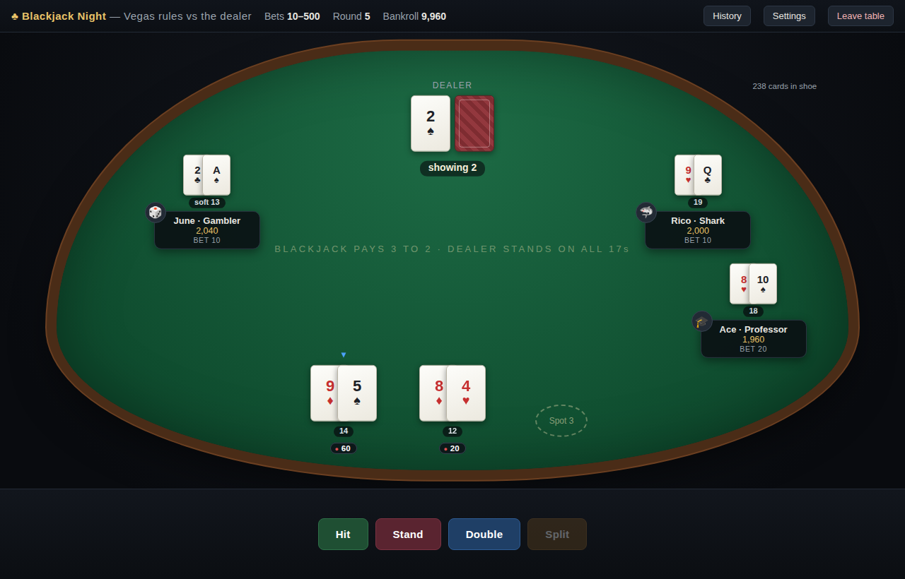

# ♠ Casino Night — local card games vs AI

Two complete casino games you play in your browser against AI opponents, with
fake money that persists between sessions. **Each game is one file — there is
nothing to install.** No server, no dependencies, fully offline.

| Game | File | You vs | Docs |
| --- | --- | --- | --- |
| ♠ **Hold'em Night** — no-limit Texas Hold'em | [`poker.html`](poker.html) | 1–7 AI opponents at one table | [rules](docs/GAME_RULES.md) · [AI](docs/AI_PLAYERS.md) |
| ♣ **Blackjack Night** — Vegas-rules blackjack | [`blackjack.html`](blackjack.html) | the dealer, alongside 0–4 AI table-mates, playing 1–3 hands at once | [rules & AI](docs/BLACKJACK.md) |

## How to run

1. Download (or clone) this repository.
2. Double-click **`poker.html`** or **`blackjack.html`** — or drag one onto a
   browser window.

Tested in Chromium-based browsers and Firefox.

## ♠ Hold'em Night


No-limit Texas Hold'em played by the book: blinds, min-raise rules, all-in side
pots, split pots ([full rule list](docs/GAME_RULES.md)). Seven AI personalities
— from *The Rock* to *Maniac* — estimate hand equity by Monte Carlo simulation
and weigh it against pot odds; they bluff, semi-bluff, and make crying calls at
personality-dependent rates ([AI design](docs/AI_PLAYERS.md)).

You start with a **10,000** bankroll; each table seat costs a **1,000** buy-in
at 5/10 blinds. Bust an opponent and they leave; take every chip and you've
cleaned out the table. Re-buys, hand history, stats, and a reset button
included.

## ♣ Blackjack Night



Vegas classic rules: 6-deck shoe, dealer stands on all 17s, blackjack pays 3:2,
double after split, split to 3 hands, insurance with a real dealer peek
([details](docs/BLACKJACK.md)). Play **1–3 spots per round** with per-spot bets
of 10–500 from a separate persistent **10,000** bankroll.

The AI table-mates play their own money against the dealer and each have a
tell: the *Professor* is a perfect basic-strategy reference, the *Shark*
actually counts cards (Hi-Lo bet spread and index plays), the *Tourist* makes
classic amateur mistakes, and the *Gambler* martingales into oblivion.

## Repository layout

```
poker.html                  Texas Hold'em (styles + engine + UI in one file)
blackjack.html              Blackjack (same single-file architecture)
tests/run-tests.mjs         Poker engine test suite (Node, no dependencies)
tests/blackjack-tests.mjs   Blackjack engine test suite (Node, no dependencies)
docs/ARCHITECTURE.md        How the single-file games are structured; engine API
docs/GAME_RULES.md          Poker rules implemented, edge cases, simplifications
docs/AI_PLAYERS.md          Poker AI personalities and decision pipeline
docs/BLACKJACK.md           Blackjack rules, AI table-mates, architecture
docs/*.png                  Table screenshots
```

## Development

Both games use the same architecture: a pure `<script id="engine">` block (game
logic, no DOM — seedable RNG throughout, so whole sessions are reproducible)
and a `<script id="ui">` block (rendering and input). See
[docs/ARCHITECTURE.md](docs/ARCHITECTURE.md).

The test suites extract each engine block from its HTML file and run it in
Node — no npm install needed (Node 18+):

```sh
node tests/run-tests.mjs          # poker: 30 tests
node tests/blackjack-tests.mjs    # blackjack: 24 tests
```

They cover the poker hand evaluator and betting edge cases (side pots,
short-all-in rules, splits of odd pots), blackjack's full basic-strategy table
and rigged-shoe round scenarios, and long seeded AI-vs-AI simulations with
chip-conservation and ledger assertions after every hand.
