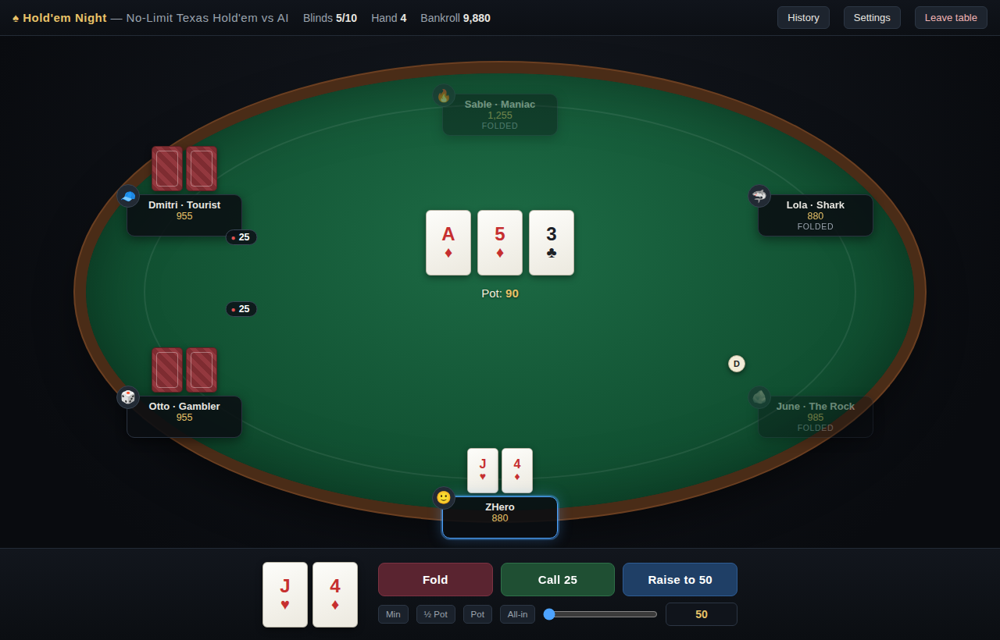

# ♠ Hold'em Night — local poker vs AI

A no-limit Texas Hold'em game you play in your browser against 1–7 AI opponents, with
fake money that persists between sessions. **The whole game is one file — there is
nothing to install.**



## How to run

1. Download (or clone) this repository.
2. Open **`poker.html`** in your browser — double-click it, or drag it onto a browser window.

That's it. No server, no dependencies, no network access — the game runs entirely
offline from a single HTML file. Tested in Chromium-based browsers and Firefox.

## What you get

- **No-limit Texas Hold'em**, played by the book: blinds, min-raise rules, all-in
  side pots, split pots, the works. See [docs/GAME_RULES.md](docs/GAME_RULES.md)
  for exactly which rules are implemented (and the few deliberate simplifications).
- **1–7 AI opponents** with distinct personalities — from *The Rock* (waits for the
  nuts) to *Maniac* (raises with anything). They estimate hand equity by Monte
  Carlo simulation and weigh it against pot odds; they bluff, semi-bluff, and make
  crying calls at personality-dependent rates. See
  [docs/AI_PLAYERS.md](docs/AI_PLAYERS.md).
- **Persistent fake-money bankroll.** You start with **10,000** chips; each table
  seat costs a **1,000** buy-in at 5/10 blinds. Winnings are banked when you leave
  the table (and snapshotted after every hand), stored in your browser's
  `localStorage`. Go broke — or just want a fresh start? *Settings → Reset
  bankroll & stats.*
- **Quality-of-life:** adjustable game speed, hand-history log, session stats
  (hands won, biggest pot, tables cleaned out), re-buy when felted, bet slider
  with min / ½-pot / pot / all-in presets.

## Playing

| Control | What it does |
| --- | --- |
| **Fold / Check / Call** | The middle button always shows the exact legal action and amount. |
| **Bet / Raise** | Set a size with the slider, the amount box, or the presets, then press the blue button. |
| **History** | Toggles the full hand-by-hand action log. |
| **Settings** | Game speed, session stats, bankroll reset. |
| **Leave table** | Between hands: banks your chips and returns to the lobby. Mid-hand: finishes the current hand first. |

If you lose your stack you can re-buy from your bankroll; if an AI player loses
theirs, they're gone. Take every chip at the table and you win the table.

## Repository layout

```
poker.html            The entire game (styles + engine + UI in one file)
tests/run-tests.mjs   Engine test suite (Node, no dependencies)
docs/ARCHITECTURE.md  How the single file is structured; engine API
docs/GAME_RULES.md    Poker rules implemented, edge cases, simplifications
docs/AI_PLAYERS.md    Personalities and the AI decision pipeline
docs/screenshot.png   The table mid-hand
```

## Development

The file has two independent script blocks: `<script id="engine">` (pure game
logic — cards, hand evaluation, betting state machine, AI — no DOM access) and
`<script id="ui">` (rendering and input). The test suite extracts the engine
block from `poker.html` and runs it in Node:

```sh
node tests/run-tests.mjs     # requires Node 18+, no npm install needed
```

The suite covers the hand evaluator (including a randomized cross-check), betting
mechanics (min-raises, short all-in re-opening rules, side pots, split pots,
blind edge cases), and a seeded 200-hand AI-vs-AI simulation that asserts chip
conservation after every hand. See [docs/ARCHITECTURE.md](docs/ARCHITECTURE.md)
before making changes.
